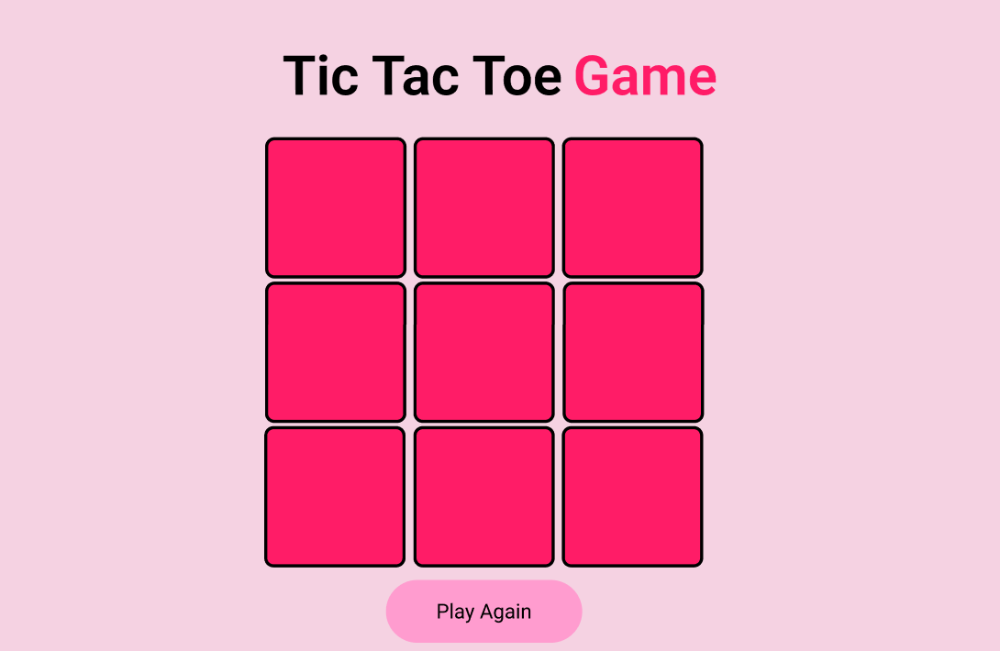

# Tic Tac Toe Game ☾⋆⁺₊🎮✩°｡

This Tic Tac Toe Game made with React can reset the game anytime, and count the points of each player.

I started the project with Figma (as always) 
### FIGMA: 

### If you want to play with, you can access click on the link:

[Access the Game🕹️](https://tic-tac-toe-tan-theta.vercel.app/)

## ---------------------------------------------------------------

### The rules
 
 The rules are the same as the normals Tic Tac Toes Games. But for those who doesn't know the game:

 - It consist in a game with two players. The player X and the player O. To win, one of the players must do a line in sequence with your image (O or X), and the other must have to try prevent the other play to win and also try to win.

 # ⋆˚࿔ Good Luck 👾 𝜗𝜚˚⋆